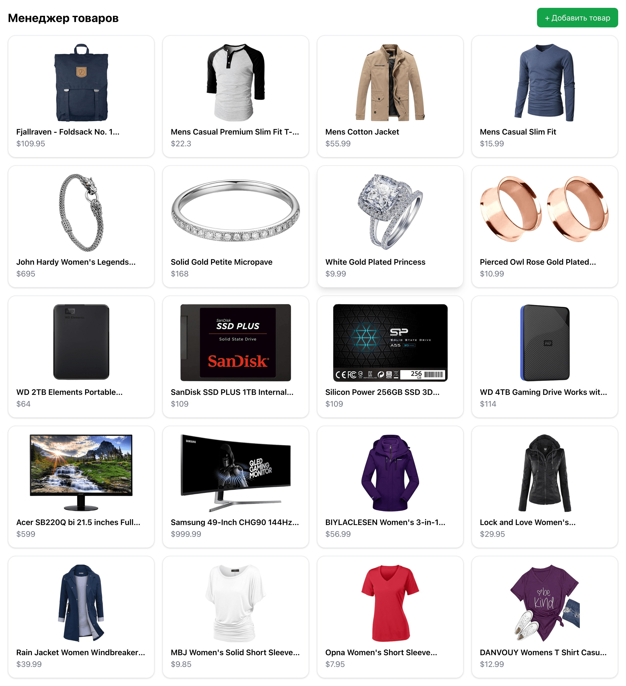

# Product Manager Frontend

**Product Manager** — это тестовое приложение для управления товарами: просмотр, добавление, редактирование и удаление.  
Проект реализован на **React + TypeScript + Redux Toolkit + Tailwind CSS**, с использованием **Mokky.dev API** для хранения данных.



---

## Функционал

-   Просмотр списка товаров (с изображением, названием, ценой, категорией и рейтингом)
-   Добавление нового товара через форму
-   Просмотр и редактирование товара в модальном окне
-   Удаление товара
-   Автоматическое обновление списка после CRUD-операций
-   Адаптивный интерфейс

---

## Используемые технологии

| Технология        | Назначение                                     |
| ----------------- | ---------------------------------------------- |
| **React**         | Компонентный UI-фреймворк                      |
| **Redux Toolkit** | Управление состоянием и асинхронными запросами |
| **Tailwind CSS**  | Утилитарная стилизация интерфейса              |
| **Axios**         | Выполнение HTTP-запросов                       |
| **TypeScript**    | Строгая типизация и стабильность кода          |

---

## API

Приложение использует сервис **[Mokky.dev](https://mokky.dev/)** для имитации backend-а.  
Все товары хранятся по адресу:

```
https://78d12f82ca58fcf6.mokky.dev/orders
```

> **API поддерживает операции**  
> **GET**, **POST**, **PATCH**, **DELETE**  
> поэтому изменения сохраняются и отображаются в интерфейсе.

---

## 🖥️ Установка и запуск

1. **Клонируйте репозиторий:**

    ```bash
    git clone https://github.com/Yaroslav-Chertov/product-manager-frontend.git
    cd product-manager-frontend
    ```

2. **Установите зависимости:**

    ```bash
    npm install
    ```

3. **Запустите проект в режиме разработки:**

    ```bash
    npm start
    ```

4. **Откройте в браузере:**
    ```
    http://localhost:3000
    ```

---

## Структура проекта

```
src/
 ├─ app/                     # Redux store и хуки
 ├─ features/
 │   └─ products/
 │       ├─ components/      # Модалки и UI-компоненты
 │       └─ productsSlice.ts # Redux slice и async thunks
 ├─ App.tsx                  # Главный компонент приложения
 ├─ index.css                # Tailwind стили
 └─ index.tsx     # Точка входа
```

---

## 🌟 Возможные улучшения

-   🔍 Реализовать фильтрацию и сортировку (по цене и рейтингу)
-   📑 Добавить пагинацию
-   🧱 Подключить собственный backend на Express или NestJS
-   🎨 Улучшить UX/UI (разработать по полноценному дизайн-макету от дизайнера)
